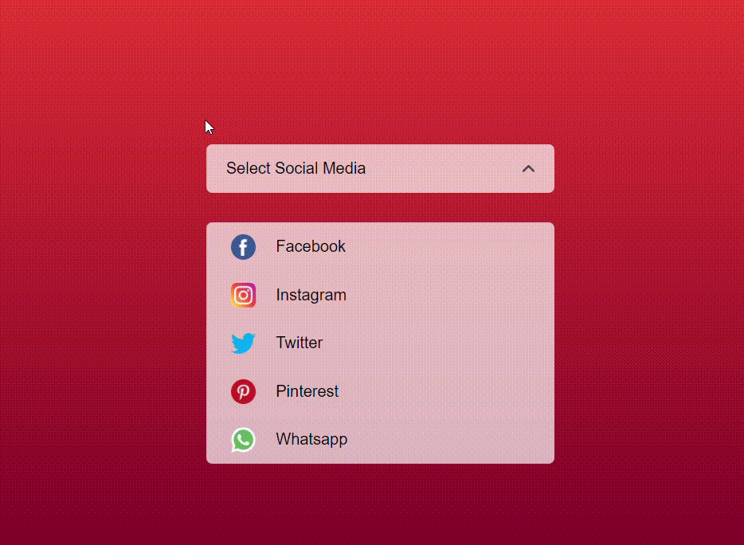

# Select Menu 📌

## Overview
The *Select Menu* is a simple and stylish web component that provides a customizable dropdown menu for selecting social media options. Users can toggle the dropdown to view and select different social media platforms.

## Technologies Used 🚀
- **HTML**
- **CSS**
- **JavaScript**

## Features 🌟
- Customizable dropdown menu for social media selection.
- Animated arrow icon for visual indication of dropdown state.
- Responsive design for various screen sizes.

## Usage 💻
1. Click on the dropdown field to reveal the list of social media options.
2. Select a social media platform from the list.

## Live Demo 🌐
Check out the live demo: [Select Menu Demo](https://select-menu-navy.vercel.app) <!-- Add your live demo link -->

## Installation 🛠️
1. Clone the repository: `git clone https://github.com/your-username/select-menu.git`
2. Open the project folder in your code editor.
3. Launch the `index.html` file in a web browser.

## Customization 🎨
- Add or remove social media options in the HTML file.
- Customize the styling in `style.css` to match your design preferences.

## Contributing 🤝
Contributions are welcome! Feel free to enhance the design, add new features, or fix any issues. Open a pull request to contribute.

## License 📜
This project is licensed under the [MIT License](LICENSE.md).

## Author ✨
- Eraycan Sivri
- Contact: eraycansivri@hotmail.com

Enjoy using the Select Menu!
